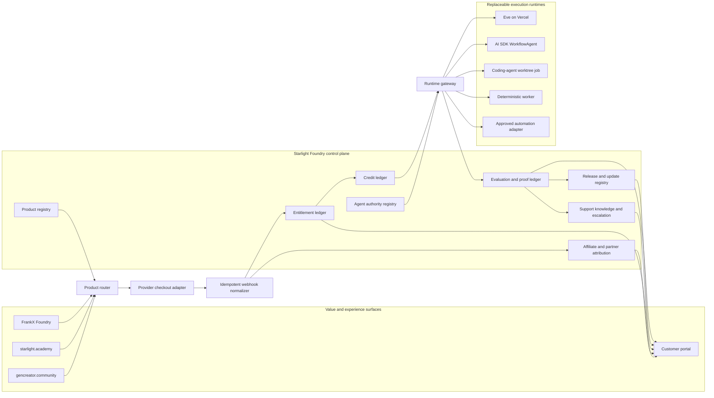
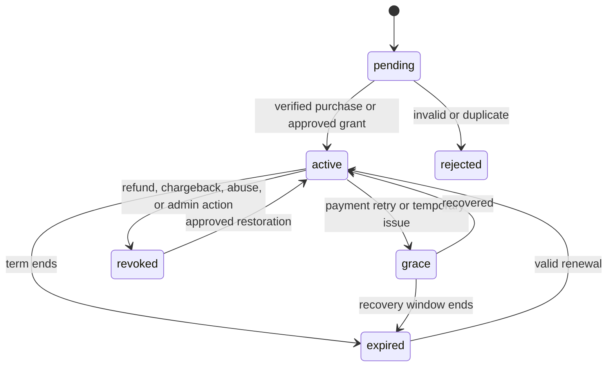

# Autonomous Foundry control-plane architecture

**Status:** implementation contract; no production runtime claim
**Date:** 2026-07-14
**Machine-readable contract:** `data/autonomous-foundry-control-plane.json`

## Architectural decision

Build a provider-neutral control plane before adding more checkouts or agents. Product truth, entitlements, service credits, agent authority, evidence, and partner attribution must remain stable when a commerce provider, model, runtime, or customer surface changes.



The diagram is a trust boundary, not a mandate for one monolith. Start with the registry and domain contracts in the canonical Foundry repo; place operational data in the approved private application database when implementation begins.

## Source-of-truth matrix

| Fact | Canonical owner | Provider or surface role |
|---|---|---|
| Product status, maturity, autonomy, and next gate | Foundry product registry | Websites render it; they do not redefine it |
| Customer identity and workspace membership | Approved app identity service | Commerce providers map to the internal customer ID |
| Purchase/subscription event | Commerce provider | Normalized once into entitlement transitions |
| Authorization to use product or agent | Entitlement ledger | Provider benefit/license may be corroborating evidence |
| Available and consumed service credits | Credit ledger | Polar usage benefits may fund or mirror grants, but do not replace receipts |
| Agent tools, write scopes, approvals, and budget | Agent authority registry | Runtime compiles and enforces the contract |
| Product version and downloadable artifact | Release registry | GitHub, portal, or provider benefit delivers the release |
| Run result and evaluation | Evidence ledger | Vercel/observability tools supply traces |
| Affiliate referral | Provider referral event plus attribution ledger | Commission follows the product’s provider policy |
| Co-creator or venture allocation | Partner attribution ledger | Payout occurs only through a human-approved agreement and route |

## Core domain contracts

### Product

```text
product_id
kind
audience
observable_outcome
owner_surface
experience_surface
maturity
autonomy_level
revenue_streams
commerce_policy
entitlement_policy
credit_policy
delivery_policy
runtime_policy
support_policy
proof[]
next_gate
```

### Entitlement

```text
entitlement_id
customer_id
workspace_id
product_id
provider
provider_event_id
provider_order_or_subscription_id
status
license_scope
granted_at
expires_at
revoked_at
reason
```

Status transitions are explicit:



### Credit ledger

Use append-only entries rather than a mutable balance:

```text
credit_entry_id
workspace_id
product_id
run_id
entry_type = grant | reserve | settle | release | expire | adjust
amount
policy_id
reason_code
created_at
actor
source_event_id
```

Balance is derived. A run reserves the approved maximum, settles actual usage, then releases the remainder. Failed work may charge only the clearly stated non-refundable portion. Manual adjustments require a reason and audit actor.

### Agent authority

```text
agent_id
role
runtime_target
runtime_status
allowed_inputs
allowed_tools
allowed_write_scopes
data_classes
approval_actions
credit_cap
time_cap
retry_policy
heartbeat_policy
receipt_schema
independent_verifier
```

An agent’s product entitlement never grants broader tool authority. Customer permission, workspace policy, product policy, and agent policy are intersected; the narrowest result wins.

### Evidence receipt

```text
run_id
customer_or_workspace_ref
product_id
product_version
agent_id
runtime
input_hash
started_at
finished_at
status
actions[]
approval_receipts[]
evaluation_results[]
artifact_refs[]
credits_estimated
credits_settled
model_and_provider_class
rollback_ref
redactions
```

Never place secrets, full private inputs, raw personal data, or private model traces in a customer-visible receipt.

## Event flow

Canonical events:

```text
pathfinder.completed
product.recommended
checkout.started
commerce.event.received
entitlement.granted
entitlement.changed
credits.granted
credits.reserved
agent.run.started
agent.approval.requested
agent.approval.resolved
agent.run.completed
agent.run.failed
credits.settled
proof.verified
release.granted
support.case.opened
support.case.resolved
partner.attribution.recorded
renewal.due
```

Every external event needs a provider event ID, idempotency key, received timestamp, processing status, and recovery path. Webhook retries must not double-grant access or credits.

## Agent fleet

| Agent | Outcome | Default writes | Sensitive approvals |
|---|---|---|---|
| Scout | Identify one product-worthy workflow from approved material | Discovery brief | Access to new private sources |
| Pathfinder | Return one buyer, process, architecture, and proof plan | Customer blueprint | None beyond approved inputs |
| Architect | Produce product, data, runtime, and gate contracts | Specs and decision record | Privacy, permissions, provider choice |
| Pack Builder | Generate skill/plugin/pack/app scaffolds and evals | Isolated worktree only | Dependency install or broad code execution |
| Verifier | Independently test claims, safety, economics, and rollback | Verdict/receipt only | Cannot approve its own work |
| Release Agent | Package, checksum, changelog, and preview release | Release candidate | Public release, production, provider publish |
| Activation Agent | Grant the correct install route and reach first win | Customer workspace within scope | Connected account writes and customer data |
| Support Agent | Diagnose known failures and route exceptions | Support case and approved repair | Refund, destructive repair, identity, billing |
| Portfolio Agent | Score products, margins, support debt, and opportunities | Private portfolio recommendation | Investment, partner, kill, or public pricing decision |

All fleet entries are currently contracts. Runtime status remains `design-only` until preview receipts prove deployment.

## Runtime routing

Use the lightest safe runtime:

| Work shape | Runtime route |
|---|---|
| Pure rules, transforms, validation, manifests | Deterministic code |
| Short model interaction with no durable side effect | AI SDK tool loop or equivalent request runtime |
| Long-running tool sequence, retries, or approval that survives restarts | `WorkflowAgent` or equivalent durable workflow |
| Filesystem-first backend agent with channels, schedules, subagents, skills, and Vercel integrations | Eve candidate |
| Repo creation, multi-file edits, tests, and Git evidence | Isolated coding-agent worktree job |
| Cross-tool business automation | Approved n8n/Make/automation adapter with heartbeat and receipts |
| Multiple independent specialisms | Governed Queen swarm with separate verifier |

Vercel documents Eve as a filesystem-first durable agent framework with Markdown instructions/skills, TypeScript tools, isolated sandboxes, channels, connections, subagents, and schedules. `WorkflowAgent` is the narrower option when a durable tool loop with retries, tracing, and human approval is the requirement.

### Eve implementation hold

The local Eve scaffold work is useful reference material, but the matching bundled dependency documentation is not present in the selected worktree. Do not write or deploy version-specific Eve runtime code from memory. The runtime lane can begin only after:

1. a clean isolated repo/worktree is selected;
2. the repo security intake passes;
3. the exact Eve version and bundled docs are installed and read;
4. auth, connection, sandbox, schedule, spend, and approval boundaries are specified;
5. a preview-only agent has an eval suite and rollback path;
6. machine admission allows the build and independent verifier.

## Experience boundary

The customer portal should show:

- owned products and versions;
- active, grace, expired, and revoked entitlements;
- current credits, upcoming expiry, estimates, and immutable run receipts;
- connected services and the exact scopes granted;
- agent runs, approvals waiting, outcomes, and downloadable artifacts;
- support state, known incidents, and escalation route;
- update availability and safe upgrade/downgrade path;
- referral/partner attribution visible to the relevant party.

It should not expose internal swarm prompts, secrets, raw traces, private partner economics, or cross-customer data.

## Failure and recovery

| Failure | Required behavior |
|---|---|
| Duplicate commerce webhook | Acknowledge; no duplicate entitlement or credits |
| Provider outage | Queue bounded retry; preserve existing valid entitlement until policy says otherwise |
| Agent exceeds estimate | Stop before cap; request approval for a new estimate |
| Agent tool fails | Retry within policy, then preserve state and open support case |
| Evaluation fails | Quarantine artifact; do not release or charge success portion |
| Refund or chargeback | Transition entitlement and future credits; retain minimal audit evidence |
| Update regression | Roll back release pointer and notify affected workspaces |
| Support cannot resolve | Escalate with redacted evidence and a clear requested decision |
| Partner attribution conflict | Freeze allocation; never auto-pay disputed shares |

## Security and privacy rules

- least privilege and per-workspace isolation;
- no provider secret in Git, browser payload, model prompt, or receipt;
- encrypt provider identifiers and personal data according to the host app policy;
- separate production and preview credentials/data;
- explicit approval for consequential writes;
- data-retention and deletion behavior per artifact class;
- prompt injection and untrusted-file controls for connected sources;
- rate, time, retry, model, and credit caps;
- heartbeat and dead-man behavior for schedules;
- human review for legal, HR, financial, health, or other high-impact outputs;
- independent release verification by a different worker/provider.

## Build sequence

1. Treat the JSON control-plane registry, validator, and dependency-free reference domain in this repo as the canonical contract.
2. Forward-test the Pathfinder and product recommendation against five distinct work shapes.
3. Replace the in-memory reference with a transactional storage port while preserving its entitlement, idempotency, reserve, settle, release, expiry, and recovery tests.
4. Add Polar and Lemon sandbox adapters behind normalized contract tests; pick one provider for the first SKU.
5. Build a preview-only customer portal showing fixtures and real test receipts clearly labeled as such.
6. Implement one bounded Eve or WorkflowAgent activation flow after version-matched docs are available.
7. Complete activation, revoke/refund, overspend, failure, support, and rollback evals.
8. Run five second-user activations without Frank.
9. Choose the first L3 product and activate one checkout only with named approval.
10. Add an L4 operator only after recurring support and economics are measured.

## First-party runtime references

- [Vercel Eve](https://vercel.com/eve)
- [Vercel Eve knowledge base](https://vercel.com/kb/eve)
- [Vercel WorkflowAgent](https://vercel.com/kb/guide/what-is-workflowagent)
- [Vercel AI SDK 7](https://vercel.com/changelog/ai-sdk-7)
