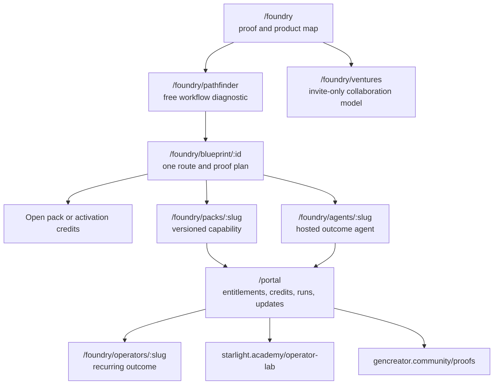

# Autonomous Foundry experience spec

**Status:** page and scene brief; public UI not yet implemented
**Date:** 2026-07-14
**Brand route:** FrankX technical spectrum, with Starlight as invisible operating substrate
**Asset tier:** Tier C is correct for system maps and product receipts; Tier A is required once real product runs exist

## First read

Within three seconds, the visitor should understand:

> Turn one real workflow into a product that agents can deliver, verify, and improve—without hiring Frank to implement it for you.

The first screen must show one inspectable mechanism or receipt. Do not use an abstract AI orb, node field, fake dashboard, or generic 3D object as the proof.

## Experience promise

The Foundry feels like a calm diagnostic instrument:

- it asks only for the information needed to choose a route;
- it returns one useful architecture and next artifact;
- it shows what is live, beta, proposed, blocked, or human-gated;
- it recommends the smallest product, including a free route;
- it explains credits and authority before an agent runs;
- it makes the generated artifact, verification, and rollback inspectable;
- it invites deeper access only after value exists.

## Route map



Use existing sites as bounded surfaces; do not merge all brands into one app.

## Page contracts

### `/foundry`

First viewport:

1. direct outcome statement;
2. one real workflow-to-product receipt or clearly labeled fixture until real proof exists;
3. primary CTA: `Map my workflow`;
4. secondary CTA: `Inspect the open system`;
5. compact truth rail: current products, autonomy level, last verified, and blocked claims.

Following sections:

- choose your starting point: workflow, existing skill/plugin, product idea, or recurring operation;
- “what should this become?” comparison for skill, plugin, pack, app, operator, swarm, and venture;
- one end-to-end proof story;
- product ladder with outcomes rather than pricing theater;
- Starlight Academy and GenCreator Community as activation paths;
- trust and human-gate explanation;
- invitation to the selective venture path after the standard product route.

### `/foundry/pathfinder`

Ask at most one decision per screen:

- who experiences the problem;
- what outcome they need;
- how often the workflow occurs;
- what sources and tools it uses;
- where human judgment is mandatory;
- what data classes are involved;
- what proof can exist in seven days;
- whether the goal is private use, a product, recurring operation, or collaboration.

Return one recommendation with rejected alternatives and the reason. The user can revise assumptions without restarting.

### `/foundry/blueprint/:id`

The artifact is the product:

- problem and buyer;
- observable outcome and baseline;
- recommended form and architecture;
- public/private boundary;
- seven-day proof;
- estimated credits and cost class;
- required approvals;
- expected artifact and evals;
- exact next action: open pack, activation credits, paid pack, wait, or refer out.

Support export to Markdown/JSON and a customer-owned GitHub repository when authorized.

### `/foundry/packs/:slug`

Show:

- outcome and fit;
- what is inside;
- current version, checksum, provenance, and changelog;
- install routes: public GitHub, private GitHub, signed ZIP, or plugin;
- permissions and data boundary;
- eval results and second-user activation evidence;
- entitlement, update, support, refund, and license scope;
- whether it is L1, L2, or L3;
- one primary access action.

Do not show “instant access” when delivery or checkout is not verified.

### `/foundry/agents/:slug`

Before run:

- outcome, inputs, connected tools, and exact write scopes;
- credit estimate and maximum;
- approvals that may be requested;
- time/retry budget;
- privacy and retention;
- example receipt.

During run:

- meaningful phases, not fake token streaming;
- current action, bounded progress, approvals, and stop control;
- resumption state for durable work.

After run:

- artifact, verification verdict, settled credits, changes made, rollback, and next option.

### `/portal`

One calm cockpit:

```text
Owned products    Active operators    Credits available
Updates ready     Approvals waiting   Support state

Recent runs
- outcome, status, artifact, verdict, settled credits, rollback

Connected services
- provider, scopes, last used, revoke
```

No fabricated metrics or decorative “AI activity.” Empty states teach the next safe action.

### `/foundry/ventures`

This is an invitation and doctrine page, not a checkout:

- what Frank/Starlight invests;
- who the studio is for and not for;
- design partner, affiliate, co-creator, and venture distinctions;
- selection score and proof period;
- ownership, privacy, attribution, and human/legal gates;
- application by a concrete workflow and contribution, not a generic pitch.

## Visual system

Use the FrankX dual-spectrum obsidian system:

| Role | Token |
|---|---|
| Background | `#0a0a0b` / `#0B0F14` |
| Primary surface | `#111113` / `#111827` |
| Strong surface | `#1a1a1f` |
| Text | `#F8FAFC` |
| Muted | `#94A3B8` |
| Technical action | `#10b981` / `#14B8A6` |
| Data/connection | `#06b6d4` |
| Human decision / value | `#f59e0b` |
| Border | restrained white 8–15% |

Typography:

- display: Outfit or Poppins, used sparingly;
- body: Inter with generous leading;
- data and receipts: JetBrains Mono with tabular numbers;
- no oversized slogan that pushes proof below the fold on mobile.

## Signature visual idea

**The Outcome Receipt.** The central visual is a real, expandable product receipt that evolves through the journey:

```text
WORKFLOW       candidate-intake
PRODUCT        ana-hr-operations (private proof)
FORM           plugin + skill pack
AUTONOMY       L1 packaged
VERDICT        install verified / commercial gate blocked
PRIVATE        client and candidate facts excluded
NEXT GATE      second-user activation + Ana consent
```

As products mature, the same object shows entitlement, credits, run evidence, evals, release, and rollback. This becomes a recognizable system language across FrankX, Academy, community, and portal surfaces.

## Motion

Static composition must work first. If motion is added:

- reveal the receipt from workflow → product → proof in three restrained state transitions;
- use 180–420ms transitions, stable geometry, and no perpetual ambient motion;
- animate causality—credit reserve, approval, verification, settlement—not decoration;
- reduced motion renders the final state with no information loss;
- avoid scroll-jacking, glowing cursor trails, orbit systems, particles, and busy dashboards.

## Asset plan

| Surface | Tier | Asset |
|---|---|---|
| Current architecture documentation | C | Exact Mermaid/vector diagrams and system tables |
| Foundry first viewport before live run | C with explicit fixture label | Coded outcome receipt; never presented as customer proof |
| Foundry first viewport after live run | A | Real redacted run receipt and artifact capture |
| Product page | A/C | Real pack contents, checksum, eval result, exact architecture diagram |
| Community | A | Member-approved proof artifacts |
| Social launch | A/B | Real artifact montage; generated scene only as supporting editorial media |

No generated image is required for the control-plane documentation. Exact diagrams are the correct medium.

## Accessibility and trust

- meet WCAG AA contrast and visible focus states;
- every diagram has an adjacent prose/table equivalent;
- status is never color-only;
- keyboard-complete Pathfinder and approval flow;
- plain-language explanation of credits and consequences;
- labels for fixture, demo, beta, live, and blocked;
- no testimonial or outcome without permission and evidence;
- consent before uploading or connecting private sources;
- delete/revoke/export routes are reachable from the portal.

## Instrumentation

Track only the minimum useful product events:

```text
workflow_map_started
workflow_map_completed
product_route_recommended
open_pack_activated
activation_credit_granted
checkout_started
entitlement_granted
agent_run_started
agent_run_completed
first_win_verified
support_case_opened
support_case_resolved
operator_enabled
proof_shared_with_consent
venture_route_requested
```

Primary experience metric: median time from `workflow_map_started` to `first_win_verified`.

## Visual QA gate

Before any public implementation ships:

1. use real route data or clearly labeled fixtures;
2. inspect desktop and mobile first viewport;
3. inspect Pathfinder completion and error paths;
4. test empty, loading, approval, insufficient-credit, failed-run, and revoked states;
5. test reduced motion and keyboard navigation;
6. inspect actual Vercel preview, not only code;
7. score 26/30 or higher under the premium asset standard;
8. obtain independent review and a rollback receipt.

The current design evidence is intentionally `iterate`: the system and page contracts are ready, but no public UI or actual export has been claimed.
