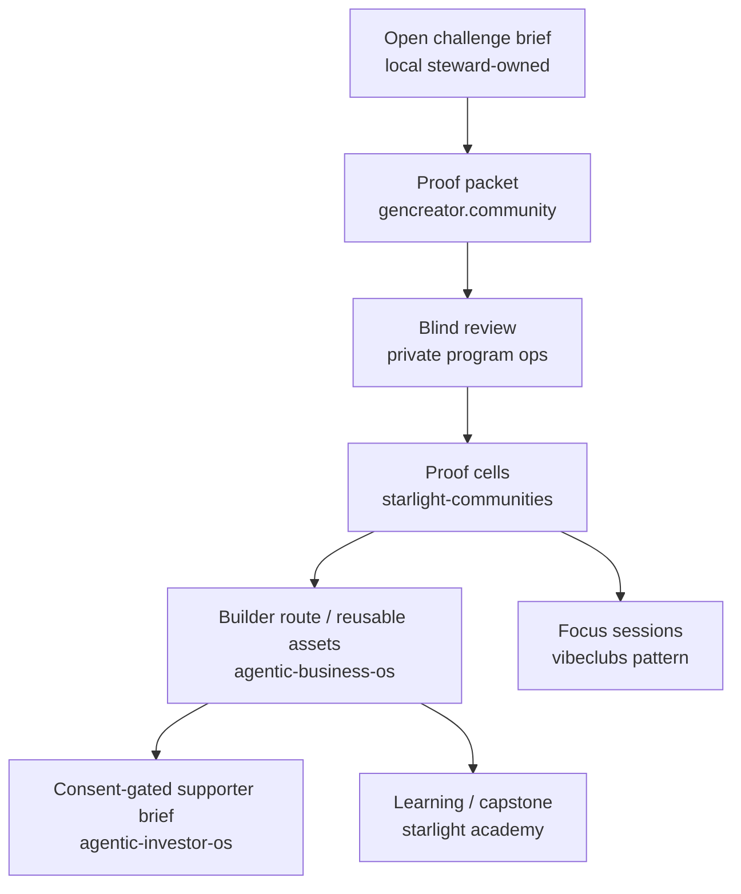

# Estate integration decision

## Audit result

The estate already has enough components to run a bounded fellowship without
creating a parallel brand, community app, or investor portal.

The review used:

- the canonical estate manifest: 118 repo entries across the Starlight lanes;
- the canonical domain registry: 34 modeled domains as of 2026-07-10;
- the authenticated `frankxai` GitHub connector snapshot on 2026-07-14: 100
  visible repositories, 52 non-archived and 48 archived;
- current Queen coordination records and existing Foundry work.

The counts are portfolio context, not public marketing claims. Full sources are
in [SOURCE_REGISTER.md](./SOURCE_REGISTER.md).

## What to use now

| Asset | Current canonical role | Fellowship use | Explicit non-use |
| --- | --- | --- | --- |
| `agentic-business-os` | Foundry strategy, packs, proof gates, selective venture economics | Canonical program package, builder pathfinding, venture-boundary doctrine | No participant CRM or paid program claim |
| `gencreator.community` / `gencreator.community` | Narrow public proof-packet artifact with a mail handoff | Participant-controlled proof packet and a future public front door | No fabricated social feed, directory, or outcome metric |
| `starlight-communities` | Weekly creation-cell operating system | Steward training, cadence, safety patterns, peer cells | No separate community SaaS launch |
| `vibeclubs.ai` | Focused-session ritual | Optional build-session/recap pattern | No membership duplicate or participant surveillance |
| `starlightintelligence.academy` | Professional Operator Lab and Architect education surface | Learning modules, technical evaluation, future capstone venue | No academy enrollment or credential claim without approval |
| `starlightintelligence.org` | Protocol, open standards, trust/download layer | Public explanation of how Starlight makes evidence and policy visible | No fellowship marketing funnel by default |
| `agentic-investor-os` | Diligence, portfolio support, investor communications OS | Private consent-gated supporter memo format | No public deal room, fund, or automated matchmaking |
| `frankx.ai` | Flagship authority and founder/product surface | Future supporter / collaborator narrative once terms are real | No capital solicitation, promise, or public applicant intake today |
| `agenticincome.ai` | Agent-as-a-Service product and revenue hub | Optional route for fellows whose evidence fits an existing product route | No pressure to become an affiliate, contractor, or customer |
| `blue-life-commons` / `oceanintelligence.app` | Evidence-led public-interest and marine lanes | A potential locally chosen challenge domain only with expert partnership | No imposed impact challenge or unsupported science claims |

## Domain decision

There is no current domain in the registry that is unambiguously a Global
Builder Fellowship brand. Do **not** register or buy a new domain yet.

Recommended first public location after approval:

```text
gencreator.community/global-builders
```

It aligns with the existing `Creator membership, proof-packet review, sprint,
and retention layer` role while preserving Vibeclubs as the session ritual and
Starlight Academy as education. A separate domain becomes justified only when
the program has a human-approved name, a rights/trademark decision, real terms,
a local-partner receipt, and evidence that a standalone identity serves fellows
rather than portfolio sprawl.

## Integration architecture



The critical architectural rule is separation of identity, submissions,
reviews, consent, and supporter interest. The first MVP can enforce this
manually with folder/data-access controls. A later app must preserve that
separation; it must not collapse them into one visible community profile.

## What not to build

- a generic global Discord before there is a small, stewarded proof cell;
- a public talent leaderboard or AI-derived ranking system;
- a marketplace that asks participants to bid for work;
- a payment, equity, grant, or token instrument before legal and operational
  approval;
- a standalone `talent` domain just because it is available;
- duplicate GenCreator Community, Vibeclubs, or Starlight Communities code;
- an investor portal that suggests funding is guaranteed or solicits an
  investment transaction.

## Why this belongs in the Foundry

The existing Foundry treats a selective venture as a proof-gated relationship,
not a default commercial entitlement. That is exactly the needed constraint:
the Fellowship can help a talented builder make a real artifact and access
support without converting every person into a contractor, affiliate, or
portfolio company.

The Foundry's relationship ladder applies after—not during—the fellowship:

```text
fellow → independent alumnus → optional design partner →
optional distribution/co-creator → separately negotiated venture partner
```

Each step needs fresh consent, evidence, and its own terms.
