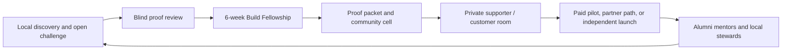

# Starlight Global Builder Fellowship

**Working title — draft-only.** A fair talent-discovery and venture-building
program for people with unusually strong ideas and maker ability, wherever they
live. It is designed to turn local insight into a tested artifact, a trusted
community, and—only when the founder opts in—a properly governed path to
customers, partners, or capital.

This is not an offshore-talent marketplace, a content contest, or a promise of
investment. It is a proof-first fellowship built on Starlight's existing
technology and community surfaces.

## The opportunity

Exceptional builders are often invisible to the networks that can fund,
distribute, or mentor their work. The answer is not to assume that people from
any country are cheap labor. It is to make discovery less dependent on pedigree,
English fluency, social following, geography, or proximity to capital—and then
to compensate people fairly for the work that creates real value.

The first research lanes are Japan, the Philippines, and Indonesia. They are
not a launch claim or a promise that one centralized program understands local
needs. Each country must pass the partner, language, payment, and participant
protection gate in [COUNTRY_PARTNER_GATE.md](./COUNTRY_PARTNER_GATE.md) before
any cohort is recruited there.

## The loop

1. **Discover** — an accessible, locally stewarded Open Build Challenge asks
   for one problem, one insight, and one small proof—not a polished pitch deck.
2. **Prove** — independent reviewers score submissions blind against a public
   rubric. Everyone receives a useful proof-plan output; selection is not the
   only value.
3. **Build** — a small paid fellowship gives selected builders tools, coaching,
   peer cells, and a real evaluation standard over six weeks.
4. **Connect** — each project gets a participant-controlled proof packet,
   customer-learning plan, and an opt-in place in the alumni community.
5. **Back** — supporters can offer feedback, pilot access, mentorship, or an
   introduction. Any investment, revenue share, equity, employment, or IP deal
   is outside the fellowship and requires separately approved human and legal
   processes.

## What exists already

The minimum viable program does **not** need a new social network or a new
domain. It composes existing estate capabilities:

| Existing surface | Fellowship role | Boundary |
| --- | --- | --- |
| `agentic-business-os` | Program doctrine, builder route selection, reusable packs, venture gates | This is the source package, not a participant database. |
| `gencreator.community` | Participant-controlled proof-packet generator and application handoff | It stays a narrow browser artifact, not a fictional live community. |
| `starlight-communities` | Weekly proof-cell cadence, steward run sheets, community safety patterns | It remains the operating-system module, not a replacement product build. |
| `vibeclubs.ai` | Opt-in focus-session ritual and recap pattern | It does not become the membership directory. |
| `starlightintelligence.academy` | Operator/technical learning modules and capstone standards | No claims of an enrolled academy cohort until confirmed. |
| `agentic-investor-os` | Consent-gated diligence briefs and supporter readiness | No public offering, fund, brokerage, or automated investor matching. |
| `frankx.ai` / FrankX network | Founder narrative and a future supporter application route | Public copy, fundraising, and outreach stay human-gated. |

The detailed estate decision is in
[ECOSYSTEM_INTEGRATION.md](./ECOSYSTEM_INTEGRATION.md).

## Pilot recommendation

Start with **one bounded APAC proof cohort**, not a worldwide platform and not
three simultaneous country launches:

- maximum 24 fellows;
- one six-week build cycle after a two-week open challenge;
- up to six small proof cells, each with a trained steward;
- Japan, the Philippines, and Indonesia remain *candidate local lanes* until
  each has an independent local steward, appropriate language support, a safe
  payment route, and a reviewed participant-protection plan;
- use local-problem tracks chosen with the steward, not imposed from Amsterdam;
- no public prize amount, participant fee, job guarantee, investment promise,
  or sponsor claim until Frank approves the exact terms.

The draft launch sequence and stop conditions are in
[LAUNCH_PACKET.md](./LAUNCH_PACKET.md).

## Non-negotiables

- Participants retain their pre-existing IP and project IP by default.
- A prize, stipend, review, or introduction never buys ownership or an
  exclusive right to use the work.
- No unpaid work for a Starlight client, sponsor, or investor is a condition of
  participation.
- First-round scoring is blind where practical; English polish, follower count,
  elite affiliation, and ability to pay are not criteria.
- Participants choose whether their artifact, name, location, or contact data
  is visible to the community or supporters.
- Finalists receive explicit terms before submitting sensitive materials.
- Starlight must not represent an investor relationship, deal, job, commercial
  partnership, or outcome before it is real and approved.
- Any local payments, taxes, employment classification, safeguarding, privacy,
  age eligibility, or investment-related activity is reviewed by the relevant
  human professionals before activation.

## Files in this package

| File | Purpose |
| --- | --- |
| [OPERATING_MODEL.md](./OPERATING_MODEL.md) | Full program, economics, technology, and measurement model. |
| [COUNTRY_PARTNER_GATE.md](./COUNTRY_PARTNER_GATE.md) | The mandatory no-parachute country-admission gate. |
| [ECOSYSTEM_INTEGRATION.md](./ECOSYSTEM_INTEGRATION.md) | Why this belongs in the Foundry and how it uses the estate without duplication. |
| [LAUNCH_PACKET.md](./LAUNCH_PACKET.md) | 90-day draft execution sequence, approvals, and stop rules. |
| [SOURCE_REGISTER.md](./SOURCE_REGISTER.md) | Estate audit and external source register. |
| [VALIDATION_STATUS.md](./VALIDATION_STATUS.md) | Local validation evidence and the pending cross-provider review gate. |
| [`data/global-builder-fellowship-pilot.json`](../../data/global-builder-fellowship-pilot.json) | Machine-readable pilot contract. |
| [`packs/global-builder-fellowship-pack`](../../packs/global-builder-fellowship-pack/) | Standalone operator skill pack. |

## Current status

`draft-only`. This package authorizes no outreach, participant intake, public
page, payment, prize, sponsor arrangement, investor introduction, data
collection, or country launch. It makes those later decisions testable and
safe to approve one at a time.
