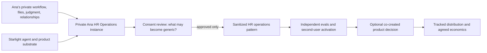

# Partner and venture economics

**Status:** decision framework; not an offer or legal agreement
**Date:** 2026-07-14
**Human gate:** every royalty, revenue-share, equity, IP, payout, or public partner claim

## Principle

Separate four things that are often blurred together:

1. someone uses a product;
2. someone refers a buyer;
3. someone contributes reusable product IP;
4. two parties build and govern a venture together.

Each deserves different economics and evidence. Calling all four “affiliate” underpays co-creators; calling every collaboration a venture creates legal and operational debt.

## Relationship ladder

| Mode | Contribution | Economic default | Ownership default | Exit |
|---|---|---|---|---|
| User / design partner | Workflow feedback and real usage | Free/discounted beta or product entitlement | No ownership transfer | Stop using or leave beta |
| Affiliate / distribution partner | Attributed introduction or audience | Provider-tracked commission on eligible settled sales | No product ownership | Disable referral relationship |
| Co-creator | Explicit reusable domain method, content, evals, or distribution asset | Product-specific royalty or net-receipts allocation | Background IP retained; new reusable IP defined in writing | Sunset product or buy out/terminate per agreement |
| Venture partner | Sustained IP, distribution, capital, operations, or brand commitment | Negotiated revenue share, royalty, equity option, or combination | Venture-specific governance and licenses | Defined wind-down, data, customer, and IP transition |

Start at the lowest truthful level. Promotion to the next level requires evidence, consent, and a signed decision—not enthusiasm alone.

## What Starlight contributes

Starlight may contribute non-cash product capital:

- architecture and product definition;
- agent, skill, plugin, pack, and app substrate;
- evals, governance, security patterns, and receipts;
- entitlement, credit, delivery, support, and update machinery;
- FrankX and portfolio distribution;
- Academy labs and proof-community access;
- partner and affiliate attribution;
- agent-led product operations after the autonomy gate.

This is not “free implementation.” It is an investment decision made only when the resulting asset can compound across customers, releases, or ventures.

## What a domain partner may contribute

- documented process and domain judgment;
- owned source material and permission to use it;
- realistic evaluation cases;
- early users, audience, or trusted distribution;
- brand, reputation, or customer relationships;
- product review and exception handling;
- consent to extract a defined sanitized generic pattern;
- ongoing governance where the domain requires it.

Private client records, confidential employer material, candidate data, or third-party IP are not a contribution the Foundry can commercialize.

## Ownership map

Every co-created product must classify assets before launch:

| Asset class | Typical owner | Rule |
|---|---|---|
| Background IP | Party who brought it | No implied transfer; license only what the product needs |
| Starlight substrate | Starlight/FrankX canonical owner | Reusable across products; private internals need not be distributed |
| Partner private workflow instance | Partner | Remains private and independently revocable |
| Sanitized generic domain module | Defined by agreement | Only explicitly consented material; no private facts |
| Customer data and generated workspace artifacts | Customer or contract-defined controller | Isolated from product training and other customers |
| Joint brand/name | Agreement-specific | No public use before approval |
| Proof/case study | Permission-specific | Scope, quote, metrics, duration, and revocation recorded |
| Improvements | Source and agreement-specific | Instance improvements do not automatically flow upstream; generic changes can be proposed |

## Distributable net receipts

Use one product-level ledger. A reasonable starting definition is:

```text
settled customer receipts excluding taxes collected for authorities
- refunds and chargebacks
- commerce and payment-provider fees
- approved affiliate commissions
- direct model, media, storage, and agent-runtime cost
- product-specific third-party API cost
- contractually defined support/refund reserve
= distributable net receipts
```

Do not deduct unrelated company overhead or invent fees after a product succeeds. Do not distribute revenue before refund/chargeback windows and provider settlement rules are understood.

Every allocation line records:

```text
product_id
period
provider
currency
settled_receipts
deduction_type
deduction_amount
allocation_basis
party_id
allocated_amount
status
evidence_refs
approved_by
paid_at
```

The agent may calculate and explain allocations. It may not approve a disputed allocation, change a contract, or send a payout.

## Economic archetypes

Use these as structures, not preset percentages:

### Affiliate

The partner receives the provider-configured commission for attributed, settled, eligible sales. Refund and self-referral policy applies. No rights in the product or customer relationship are implied.

### Domain royalty

The partner licenses a defined reusable method or content asset to one product and receives a product-specific royalty. Specify the revenue base, term, territories, update duties, audit rights, and end-of-life behavior.

### Net-receipts collaboration

Both parties contribute to a co-created product. Distributable net receipts are allocated by the written product agreement. Record source and contribution assumptions; revisit only through a human-approved amendment.

### Venture option

The partners first complete a bounded proof period. If distribution, autonomy, trust, and economics pass, a separate venture agreement may grant an equity option or longer-term revenue participation. The proof period does not imply equity.

## Ana HR operations example

Ana’s tailored HR operations plugin is a useful design-partner proof. It is not automatically a public product or agreed venture.

Safe structure:



Until Ana explicitly agrees otherwise:

- her private workflows, source documents, client/candidate facts, identity, and relationships remain hers;
- Starlight substrate remains reusable Starlight IP;
- no public case study, pricing, title, biography, promise, or revenue split is assumed;
- a sanitized generic module must be reviewed item by item;
- her referral traffic can be attributed separately from co-creator economics;
- any royalty, net-receipts share, venture interest, or support responsibility is a future human/legal decision;
- neither party should owe implementation hours as the product’s default fulfillment model.

## Partner selection score

| Factor | Weight | Evidence |
|---|---:|---|
| Mutual trust and enjoyment | 20 | History, reliability, conflict behavior |
| Domain authority | 15 | Real practice, owned sources, evaluation quality |
| Repeatable outcome | 15 | Frequency, baseline, observable output |
| Distribution advantage | 15 | Audience, relationships, channel evidence |
| Agent-fulfillment potential | 15 | Structured inputs, tool access, exception rate |
| Risk and support feasibility | 10 | Privacy, regulation, liability, support volume |
| Ecosystem and mission fit | 10 | Brand coherence, learning value, reusable assets |

Required decision fields:

```text
score
red_gates[]
recommended_mode
bounded_proof
starlight_capital_at_risk
partner_contribution
success_threshold
stop_date
promotion_decision
```

Score 75+ permits consideration; it never forces a deal. Any red gate stops the venture route.

## Portfolio governance

The Portfolio Agent prepares a monthly private recommendation for each candidate or live product:

- keep, invest, automate, reprice, partner, pause, sunset, or refer out;
- outcome and retention evidence;
- founder minutes and unresolved support debt;
- provider and agent cost;
- attribution and allocation status;
- autonomy level and failed gates;
- private/public IP boundary;
- next smallest investment.

Frank approves portfolio moves. No agent may create a legal entity, agree to equity, modify partner terms, pay a partner, issue a refund outside policy, publish a case study, or represent another person without explicit authority.

## Affiliate cooperation across the ecosystem

Partners may earn in two directions:

- refer buyers to eligible Starlight products through the product’s approved merchant affiliate program;
- publish current, disclosed recommendations for third-party tools through the Agentic Income network.

The two ledgers remain separate. A Starlight product commission is not evidence that a third-party tool is best, and a third-party affiliate payout never changes the Foundry’s architecture recommendation.

## Agreement checklist

Before any co-created paid launch, record:

- named parties and product;
- background IP and licenses;
- permitted private-to-generic extraction;
- customer and personal-data roles;
- deliverables and autonomy/support responsibilities;
- attribution and public claim permissions;
- revenue base, deductions, allocation, settlement, and audit;
- tax, invoice, refund, and chargeback handling;
- affiliate overlap and conflict rules;
- term, termination, sunset, and customer continuity;
- security, incident, and confidentiality duties;
- dispute process and governing law;
- human sign-off and professional review where appropriate.

This document supplies product architecture, not legal or tax advice.
