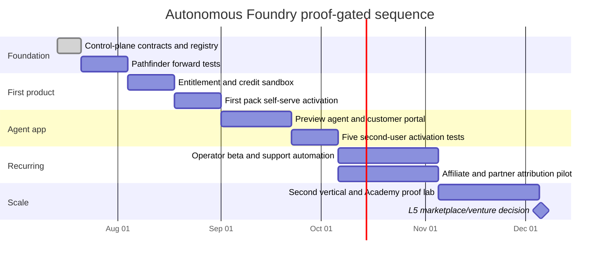

# Autonomous Foundry blitzscale roadmap

**Status:** execution roadmap with proof gates
**Date:** 2026-07-14
**Constraint:** scale throughput only after activation, economics, support, and recovery are verified

## Blitzscaling rule

Blitzscale the reusable product loop, not headcount, cloud spend, deployment count, or unverified SKUs. Each wave must make the next product cheaper and safer to create without increasing Frank’s fulfillment burden.

Dates are sequencing aids, not promises. A failed gate pauses the dependent work.

## Wave 0 — control plane (now)

### Build

- canonical autonomous product, autonomy, agent, credit, commerce, and venture registry;
- machine-checkable invariants and schema;
- dependency-free entitlement and credit reference domain with normalized commerce events and failure/recovery tests;
- product ladder, control-plane architecture, venture economics, and experience spec;
- queue-compatible four-role swarm packet held outside the live inbox;
- no-human-implementation license gate;
- current provider and runtime decisions grounded in first-party docs.

### Done when

- registries and JSON schemas parse;
- validator passes positive fixtures and rejects policy violations;
- entitlement, duplicate event, refund/revoke, credit reserve/settle/release, overspend, and failed-run tests pass;
- current live/prototype/design-only claims are separated;
- the README routes builders to the new source of truth;
- an independent verifier can execute the held packet when machine admission permits.

### Do not do

- install dependencies, start servers, create a new swarm, or deploy while PP is `HOLD`;
- activate billing, publish prices, or claim agents are live;
- write Eve-version-specific code without matching local docs.

## Wave 1 — one product, one provider, one first win

Choose one low-risk product that can reach L3. The preferred candidates are the Pathfinder agent app or a sanitized Starlight Pack. Ana’s HR operations pattern is eligible only with her explicit consent and a clean private/generic separation.

### Build

- five Pathfinder route tests: domain operator, creator, agency, SME, and selective collaborator;
- provider-neutral entitlement and append-only credit modules;
- Polar and Lemon Squeezy sandbox contract tests, then select one provider for the first SKU;
- versioned release bundle with checksum, provenance, license scope, changelog, and revoke behavior;
- activation agent that reaches a small first win;
- support knowledge for known failures;
- one real customer portal path in preview.

### Gates

- one provider per SKU;
- duplicate webhooks do not duplicate access or credits;
- refund/cancellation/revoke fixtures pass;
- five people can install or activate without Frank;
- at least four reach the declared first win;
- median founder assistance is under ten minutes and caused by documented exceptions;
- cost and credit estimate error stays within the agreed test tolerance;
- independent verifier passes privacy, claims, recovery, and release evidence.

### Kill or simplify when

- setup remains bespoke after three activations;
- support cost exceeds plausible margin;
- customers value the advice but not the artifact;
- a plain skill or deterministic tool produces the same outcome more safely.

## Wave 2 — first Vercel agent app

### Runtime choice

- choose Eve when the filesystem-first agent, reusable skills, channels, connections, schedules, sandbox, or subagents are the product shape;
- choose `WorkflowAgent` when the core need is a durable tool loop with retries, tracing, and approvals;
- choose deterministic workers for rules and transforms;
- use coding agents only for isolated repo-building jobs with evidence.

### Build

- authenticated preview app;
- product recommendation, entitlements, credits, connected-service scopes, run history, approvals, and artifacts;
- one bounded activation agent and one independent verifier;
- estimates, reservations, settlement, and budget stop;
- heartbeats, alerts, redacted traces, recovery, and rollback;
- no fake agent dashboard: every run shown must have a real fixture or preview receipt label.

### Gates

- version-matched runtime docs read and recorded;
- security intake and dependency review pass;
- ten bounded beta workspaces; five complete repeated runs;
- zero cross-workspace leakage;
- approval survives timeout/restart in the durable route;
- failed runs recover or escalate without founder intervention;
- no production promotion before independent cross-provider verification.

## Wave 3 — recurring operator and community loop

### Build

- one L4 operator subscription with a monthly credit allowance;
- support agent, known-issue automation, and escalation packet;
- starlight.academy operator lab tied to the same real product;
- gencreator.community proof cell tied to artifacts and retrospectives;
- update pass and product release feed;
- merchant affiliate pilot for one eligible SKU;
- outbound recommendation content only through verified/disclosed Agentic Income records.

### Gates

- repeated outcome shows retention value;
- gross margin remains positive after runtime, provider, refund, affiliate, and support cost;
- at least 80% of known support cases are agent-resolved or self-served;
- renewal and cancellation are clear and tested;
- community activity produces artifacts, not vanity posting;
- affiliate attribution, refunds, and abuse cases pass.

## Wave 4 — second vertical and venture portfolio

### Build

- use the same factory to produce a second vertical without copying private material;
- partner score, IP map, contribution ledger, and bounded proof for each collaborator;
- product-level distributable-net-receipts reporting;
- portfolio agent recommendations: invest, automate, pause, sunset, or partner;
- one approved co-creator agreement only after product proof;
- optional venture structure only after sustained distribution and autonomy evidence.

### Gates

- second vertical reuses at least 60% of generic control-plane and activation machinery;
- no customer or partner-specific facts enter the generic pack;
- attribution disputes freeze, rather than auto-pay, allocations;
- legal/tax review completes before any royalty, revenue-share, or equity commitment;
- Frank can decline a venture while the collaborator still keeps a useful product path.

## Wave 5 — marketplace decision, not assumption

Launch a marketplace only if the portfolio has enough verified products and supply quality to justify one.

Required evidence:

- at least three L3 products from two domains;
- at least one L4 operator with healthy retention and support economics;
- standardized install, license, update, evaluation, and receipt contracts;
- reputation signals based on verified use, not paid placement;
- compliant seller onboarding, payouts, tax, IP, refunds, and dispute handling;
- provider acceptable-use confirmation for the exact model;
- independent security and marketplace abuse review.

Until then, use a curated catalog and direct product checkouts. A marketplace homepage is not a marketplace.

## Four-role execution team

The deterministic Starlight team resolver selected:

1. **Coordinator / chief product operator** — scope, route, integration, decision ledger.
2. **Backend/data engineer** — entitlements, credits, webhooks, idempotency, recovery.
3. **GTM/analytics operator** — value-first funnel, activation events, support loop, experiments.
4. **Independent QA/release/SRE verifier** — evidence, release, rollback, and pass/fail verdict.

Excluded from the first execution wave:

- frontend, motion, and visual specialists until a public implementation surface is authorized and the machine admits browser QA;
- a separate AI-evaluation role until the runtime implementation begins; the independent verifier owns initial contract evaluation;
- legal, finance, sales, and payout agents because those actions remain human-gated.

Worker scopes may not overlap. The verifier cannot modify release code or verify its own work.

## Machine-aware swarm activation

The four job envelopes live under `jobs/swarm/held/`. They are deliberately not in `queen/inbox`.

Activation sequence:

1. rerun `pp preflight --workload swarm`;
2. require `allow` or a bounded posture that explicitly permits the selected roles;
3. reread `queen/COORDINATION.md` and current branches;
4. create one isolated worktree per writer;
5. enqueue serially or at the admitted concurrency;
6. require `resultRef` evidence for completion;
7. run the independent verifier through a different provider;
8. integrate only after human gates and diff review.

Never copy the held packets into the live inbox merely because a roadmap date arrived.

## Operating dashboard

Report weekly:

| Dimension | Metric |
|---|---|
| Activation | time to first win; completion without founder help |
| Autonomy | products by L0–L5; agent-resolved support rate |
| Economics | settled revenue, direct cost, gross margin, founder minutes |
| Credits | estimates, reservations, settlement variance, failed-run charges |
| Trust | eval pass rate, incident count, rollbacks, privacy/claims failures |
| Portfolio | owned, affiliate, partner, and venture revenue by product |
| Compounding | reusable patterns, tests, skills, connectors, and updates extracted |
| Focus | products advanced, paused, and killed |

## Human approvals on the critical path

- first public SKU and price;
- commerce provider account/configuration and live webhook secret;
- any production deployment or domain change;
- customer/partner claim or public case study;
- Ana or any collaborator’s private-to-generic consent;
- terms, license scope, refund policy, affiliate commission, or partner economics;
- model/platform spend and credit package;
- marketplace, payout, revenue-share, royalty, equity, or entity decision.
