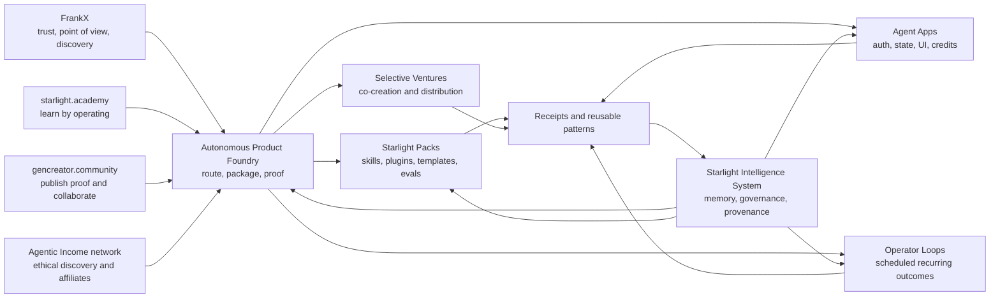
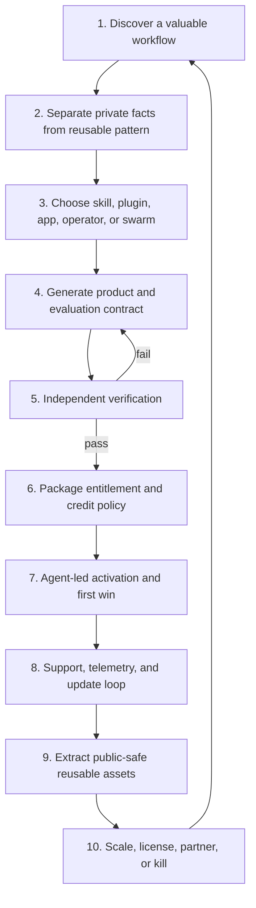

# Starlight Autonomous Product Foundry — master plan

**Status:** canonical direction for the next Foundry phase
**Date:** 2026-07-14
**Owner:** FrankX
**Substrate:** Starlight Intelligence System
**Canonical open product:** `agentic-business-os`
**Supersedes:** the implementation-fee ladder in the 2026-07-10 Foundry plan

## Decision

Build one **Autonomous Product Foundry** inside the existing FrankX Foundry. Do not create another umbrella brand.

The Foundry converts a real workflow into a governed product that agents can discover, package, test, deliver, activate, support, improve, and measure. Frank contributes taste, architecture, relationships, distribution, and approval. He does not become the fulfillment queue.

The economic unit is not an hour, prompt, or consulting engagement. It is:

> a verified outcome loop with a product entitlement, bounded agent authority, usage budget, evidence receipt, update path, and support boundary.

“Passive” means low marginal founder labor after the loop is proven. It never means no operations, no costs, guaranteed income, or unsupervised authority.

## The ecosystem in one picture

### Property roles

| Property | Job | Commercial role |
|---|---|---|
| FrankX | Founder-facing authority and value-first entry | Routes the right person to one useful next result |
| Agentic Business OS | Open source, product definitions, packs, contracts, and public proof | Trust and distribution; canonical product source |
| Starlight | Private substrate for memory, governance, provenance, orchestration, and reusable intelligence | Moat; not sold as a vague platform |
| starlight.academy | Operator labs, evaluations, and capability paths | Membership or product-bundled learning after proof |
| gencreator.community | Artifact-to-proof practice and collaborator discovery | Community access, proof cells, partner distribution |
| GenCreator.ai | Creator-facing apps, portal, entitlements, and existing commerce integrations | Customer experience where creator workflows need state |
| Agentic Income network | Current, disclosed product research and recommendations | Affiliate revenue that follows genuine usefulness |
| Vertical packs | Domain-specific skills, plugins, apps, and operator loops | One-time, recurring, credit, update, or partner revenue |

Starlight is the common operating substrate. The customer should encounter a concrete outcome, not an estate diagram.

## Who this is for

Prioritize people with a workflow worth owning:

1. **Domain operators** with repeatable expertise hidden in documents, checklists, and judgment.
2. **Creators and educators** with trust or distribution but no reliable product-delivery system.
3. **Small teams and agencies** repeating intake, research, production, QA, or reporting work.
4. **AI-native founders** who need governed agents, proof, entitlements, and distribution rather than another prototype.
5. **A select few collaborators Frank genuinely likes** where the relationship can become a product or venture without turning into client service.

Do not accept a workflow when there is no observable outcome, no safe source material, no repeatability, or no credible path to agent fulfillment. Avoid “get rich” positioning, generic custom development, and regulated or high-liability automation without the appropriate controls.

## The refinery loop

Every workflow produces two different assets:

- a **private instance**, containing the operator’s data, brand, customer context, and permissions;
- a **sanitized product pattern**, containing only reusable doctrine, schemas, tests, tools, and examples that the contributors have explicitly permitted.

Private material never becomes a product merely because an agent can copy it.

## Autonomy ladder

| Level | State | What Frank still does | Commercial rule |
|---|---|---|---|
| L0 — discovered | Process notes or bespoke work | Everything | Do not sell |
| L1 — packaged | Skill, plugin, or template with instructions | Guides setup and resolves failures | Free, private, or research beta |
| L2 — agent-delivered beta | Agent creates and validates the customer artifact | Approves exceptions and studies failures | Bounded paid beta is possible; no resale license |
| L3 — self-serve product | Checkout-to-first-win works without Frank | Reviews metrics and uncommon escalations | One-time product, update pass, or own-use license may launch |
| L4 — autonomous operator | Recurring outcome, metering, support, rollback, and renewal are agent-run | Sets policy and approves sensitive actions | Subscription and service-credit products may scale |
| L5 — partner-scale system | Multiple operators, attribution, update channels, independent verification | Makes portfolio and relationship decisions | Partner licensing, marketplace, and venture replication may scale |

No product may describe itself as autonomous, licensed, or passive before its current level is supported by receipts.

## No-human-implementation gate

A product cannot enter public paid licensing until all of these are true:

- a second user activates it without Frank;
- the happy path requires no manual setup or support intervention;
- evaluation cases and privacy/claims checks pass;
- each consequential write is least-privilege, reversible, and receipted;
- entitlement grant, revoke, expiry, and refund behavior work;
- cost estimates, caps, and failed-run settlement are visible;
- rollback and recovery have been exercised;
- support automation resolves known issues and escalates the rest;
- the update channel, changelog, provenance, and license boundary are clear;
- public terms and any commercial rights received named human/legal approval.

Until then, it is a prototype, design-partner build, or closed beta—not a license business.

## Product and revenue portfolio

| Stream | Buyer value | Revenue shape | Autonomy target |
|---|---|---|---|
| Open Foundry | Useful route and proof plan | Free distribution | L1 |
| Starlight Packs | A complete reusable capability | One-time purchase | L3 |
| Update Pass | Verified improvements and new evals | Annual or release-channel entitlement | L3 |
| Agent Apps | Outcome through a stateful interface | Subscription and/or usage credits | L3–L4 |
| Operator Loops | A recurring business result | Subscription with included credits | L4 |
| Credit top-ups | More bounded agent work | Usage revenue | L4 |
| Academy labs | Learn by operating a real system | Membership or product bundle | L3 |
| Proof community | Feedback, proof cells, collaborators | Membership or bundle | L3 |
| Partner referrals | Trusted distribution | Disclosed affiliate commission | L3 |
| Product royalties | A collaborator’s reusable contribution | Product-specific net-receipts allocation | L4–L5 |
| Marketplace | Discovery, trust, fulfillment, and updates | Take rate only after platform proof | L5 |
| Venture portfolio | Shared product and distribution upside | Contracted revenue share, royalty, or equity option | L5 |
| Sponsorship and platform programs | Subsidized access or distribution | Credits, sponsorship, or referral income | Evidence-dependent |

Do not launch all streams at once. Build one cash engine, one recurring engine, and one option engine:

- **Cash engine:** high-quality packs and update passes that agents can fulfill.
- **Recurring engine:** one operator subscription with transparent credits and receipts.
- **Option engine:** selective co-created products and ventures with attribution from day one.

## Value-first access, not blunt selling

The public journey should feel like a useful product before it asks for payment:

```mermaid
flowchart LR
    A["See a real workflow proof"] --> B["Run a free Pathfinder"]
    B --> C["Receive one architecture and artifact plan"]
    C --> D["Try activation credits or an open pack"]
    D --> E["Unlock the exact pack or agent needed"]
    E --> F["Reach a verified first win"]
    F --> G["Choose updates, operator subscription, or community"]
    G --> H["Earn partner access by proof and trust"]
```

Rules:

- show mechanism and proof before a checkout;
- gate deeper capability by relevance, safety, and entitlement—not artificial obscurity;
- use an agent to recommend one next product, including “stay free” or “do nothing”;
- make prices, renewal, credit consumption, support, and cancellation plain;
- use transactional email for receipts and secure access links, not attachment delivery;
- never hide the free/open foundation to force a sale.

## Service credits

Starlight credits are non-transferable service units for bounded agent actions. They are not money, crypto, stored value, an investment, or a revenue-share instrument.

Each action must:

1. show an estimated credit range before it runs;
2. reserve no more than the approved cap;
3. settle actual usage after completion;
4. release unused reserves on failure or cancellation;
5. create a receipt containing the product, agent, action, model/provider class, result, and charged credits;
6. stop before exceeding the user or workspace budget.

The initial credit rates are relative product hypotheses, not public price commitments. Validate them against actual provider cost, gross margin, customer value, failure rates, and support load.

## Commerce decision

Use one internal entitlement contract with provider adapters. Never make Polar, Lemon Squeezy, Whop, Stripe, GitHub, or email the canonical customer record.

- **Polar candidate:** developer-native packs and agent products where built-in credits, license keys, downloads, GitHub access, Discord access, and customer benefits reduce fulfillment work.
- **Lemon Squeezy candidate:** digital downloads, subscriptions, license keys, and products where its native affiliate program is central to distribution.
- **Existing provider:** preserve a working product’s existing commerce integration until a measured migration is justified.
- **Venture and marketplace allocations:** keep a separate attributed net-receipts ledger and human-approved payout process. Polar’s current acceptable-use policy excludes marketplace/revenue-share resale models, so it must not be used as the venture payout engine.

One SKU has one commerce provider. Both providers may exist across the portfolio, never as duplicate checkout paths for the same product.

## Selective venture model

Frank’s scarce contribution is not delivery time. It is judgment, product architecture, trusted relationships, ecosystem access, distribution, and willingness to invest Starlight capability.

Use four relationship modes:

| Mode | Exchange | Appropriate when |
|---|---|---|
| Design partner | Early access and feedback; no implied ownership | Learning whether the product works |
| Distribution partner | Tracked referral and disclosed commission | The partner brings an audience or customers |
| Co-creator | Product-specific royalty or net-receipts allocation | The partner contributes reusable domain IP with consent |
| Venture partner | Negotiated revenue share, royalty, or equity option | Both sides invest enduring assets and accept portfolio risk |

Every relationship begins in the smallest truthful mode. A friendship does not automatically become a venture, and a useful workflow does not automatically grant rights to commercialize it.

## Portfolio decision system

Score candidate products out of 100:

| Factor | Weight |
|---|---:|
| Trust and desire to work together | 20 |
| Domain authority and source quality | 15 |
| Workflow repeatability and observable outcome | 15 |
| Distribution advantage | 15 |
| Agent-fulfillment potential | 15 |
| Risk, privacy, and support feasibility | 10 |
| Joy, mission, and ecosystem fit | 10 |

Default route:

- **75–100:** consider a bounded design partnership or venture option;
- **60–74:** sell or share a standard product only; do not invest a venture lane yet;
- **below 60:** stay open/free, refer elsewhere, or decline;
- **any red gate:** stop regardless of score.

Red gates include unclear IP rights, unsafe data, regulated decisions without controls, unbounded support, no measurable outcome, unreliable partner behavior, or a business model dependent on misleading claims.

## Founder allocation

Use a 70/20/10 product-capital policy as a planning default, not a time sheet:

- 70% of system-building capacity to proven products and recurring operator loops;
- 20% to selected partner products with distribution evidence;
- 10% to high-upside experiments, new agents, and platform primitives.

Frank should personally enter only decisions that improve product taste, relationship quality, risk boundaries, or portfolio direction. If a recurring step merely moves information, formats an artifact, verifies a rule, or routes an exception, it belongs to an agent.

## Metrics that matter

Measure leverage and trust, not activity:

- median time to first verified outcome;
- activation completion without founder help;
- agent-resolved support rate;
- founder minutes per activated customer and per renewal;
- gross margin after model, platform, refund, affiliate, and support costs;
- credits estimated versus settled;
- successful run, rollback, and recovery rates;
- update adoption and product retention;
- pack-to-app and app-to-operator expansion;
- product revenue by source: owned, affiliate, partner, and venture;
- reusable patterns extracted per private implementation;
- number of products killed before they became support debt.

The north star is **verified customer outcomes per founder decision**, not revenue per hour.

## Current truth and immediate constraint

As of 2026-07-14, the open Foundry, packs, Ana’s tailored HR operations plugin, Academy/community surfaces, and several commerce integrations provide real ingredients. They do not yet constitute a live autonomous commercial fleet. A read-only Vercel inspection found no production Agent Run projects in the preceding 30 days, so the runtime is classified as design-only until real preview and production receipts exist.

The machine performance gate also returned `HOLD` for a new local swarm. This foundation is therefore being built by one bounded lead lane, with dormant queue-compatible team contracts for later execution. No document may convert that constraint into a claim that the swarm or Eve agents are already deployed.

## Non-negotiable human gates

Human approval remains required for production promotion, DNS, credentials, billing activation, spend, provider migration, data migration, permissions, customer or partner claims, external sends, public pricing, refunds outside policy, legal/IP terms, revenue-share or equity commitments, marketplace payouts, brand identity, and destructive actions.

## First-party implementation references

- [Polar automated benefits](https://docs.polar.sh/features/benefits)
- [Polar acceptable-use boundaries](https://docs.polar.sh/merchant-of-record/acceptable-use)
- [Lemon Squeezy products](https://docs.lemonsqueezy.com/help/products)
- [Lemon Squeezy merchant affiliate program](https://docs.lemonsqueezy.com/help/affiliates-for-merchants)
- [Vercel Eve](https://vercel.com/eve)
- [Vercel WorkflowAgent](https://vercel.com/kb/guide/what-is-workflowagent)
